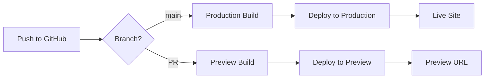

# 배포 가이드 🚀

## Vercel 배포 설정

### 1. 사전 준비사항

- [Vercel 계정](https://vercel.com/signup) 생성
- GitHub 저장소와 연동
- Supabase 프로젝트 생성 및 API 키 준비

### 2. Vercel CLI 설치

```bash
npm install -g vercel
```

### 3. 로컬에서 배포하기

#### 첫 배포
```bash
# Vercel 로그인
vercel login

# 프로젝트 디렉토리에서 실행
vercel

# 프롬프트에 따라 설정:
# - Set up and deploy? Yes
# - Which scope? (본인 계정 선택)
# - Link to existing project? No
# - Project name? couple-fine-webapp
# - In which directory is your code? ./
# - Want to override settings? No
```

#### 프로덕션 배포
```bash
vercel --prod
```

### 4. GitHub 자동 배포 설정

1. [Vercel Dashboard](https://vercel.com/dashboard)에서 프로젝트 선택
2. Settings → Git → GitHub 저장소 연결
3. 자동 배포 설정:
   - Production Branch: `main`
   - Preview Branches: 모든 PR

### 5. 환경 변수 설정

Vercel Dashboard에서 설정:
1. Settings → Environment Variables
2. 다음 변수 추가:
   ```
   VITE_SUPABASE_URL=your_supabase_url
   VITE_SUPABASE_ANON_KEY=your_supabase_anon_key
   ```
3. 모든 환경(Production, Preview, Development)에 적용

### 6. GitHub Actions 설정 (선택사항)

GitHub Secrets 추가:
1. GitHub 저장소 → Settings → Secrets and variables → Actions
2. 다음 시크릿 추가:
   - `VERCEL_TOKEN`: Vercel 계정 설정에서 생성
   - `VERCEL_ORG_ID`: Vercel 프로젝트 설정에서 확인
   - `VERCEL_PROJECT_ID`: Vercel 프로젝트 설정에서 확인

### 7. 커스텀 도메인 연결 (✅ 완료)

**도메인**: joanddo.com

#### 설정 완료 사항:
- ✅ 도메인 구매 (Vercel)
- ✅ DNS 레코드 설정
  - ALIAS: cname.vercel-dns-017.com
  - CAA: "letsencrypt.org"
- ✅ SSL 인증서 자동 발급
- ✅ Auto Renewal 활성화

#### 남은 작업:
1. Vercel 프로젝트와 도메인 연결
2. Production 배포 실행

## 배포 URL 구조

```
Production: https://joanddo.com
Vercel URL: https://couple-fine-webapp.vercel.app
Preview: https://couple-fine-webapp-[branch]-[username].vercel.app
```

## 빌드 설정

`vercel.json` 파일 설정:
```json
{
  "buildCommand": "npm run build",
  "outputDirectory": "dist",
  "framework": "vite",
  "rewrites": [
    {
      "source": "/(.*)",
      "destination": "/index.html"
    }
  ]
}
```

## 배포 체크리스트

### 배포 전
- [ ] `npm run build` 성공 확인
- [ ] TypeScript 에러 없음
- [ ] 환경 변수 설정 완료
- [ ] 테스트 통과

### 배포 후
- [ ] 배포 URL 접속 테스트
- [ ] 모바일 반응형 확인
- [ ] PWA 설치 테스트
- [ ] 로그인 기능 테스트
- [ ] 네비게이션 테스트

## 트러블슈팅

### 빌드 실패
```bash
# 로컬에서 빌드 테스트
npm run build

# TypeScript 에러 확인
npm run type-check
```

### 환경 변수 미적용
- Vercel Dashboard에서 환경 변수 확인
- 변수명이 `VITE_`로 시작하는지 확인
- Redeploy 실행

### 404 에러
- `vercel.json`의 rewrites 설정 확인
- SPA 라우팅 설정 확인

## 모니터링

### Vercel Analytics
1. Dashboard → Analytics 탭
2. Web Vitals 확인
3. 성능 지표 모니터링

### 에러 추적
1. Vercel Functions 로그 확인
2. Runtime 로그 확인
3. Build 로그 확인

## 롤백

문제 발생 시 이전 버전으로 롤백:
1. Vercel Dashboard → Deployments
2. 정상 작동하던 배포 선택
3. "Promote to Production" 클릭

## 성능 최적화

### 번들 크기 분석
```bash
npm run build
# dist 폴더 크기 확인
```

### 최적화 팁
- 이미지 최적화 (WebP 사용)
- 코드 스플리팅 적용
- Tree shaking 확인
- 불필요한 의존성 제거

## CI/CD 파이프라인



## 보안 고려사항

- 환경 변수는 절대 코드에 하드코딩하지 않기
- `.env` 파일은 `.gitignore`에 포함
- Supabase RLS 정책 설정 확인
- HTTPS 강제 적용 (Vercel 기본 제공)

## 참고 링크

- [Vercel 문서](https://vercel.com/docs)
- [Vite on Vercel](https://vercel.com/guides/deploying-vite)
- [Vercel CLI 문서](https://vercel.com/docs/cli)
- [GitHub Actions for Vercel](https://vercel.com/guides/how-can-i-use-github-actions-with-vercel)

---

*최종 업데이트: 2025-08-07*